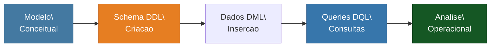

# Projeto Logico de Banco de Dados - Oficina Mecanica

<div align="center">


**[PT-BR](#sobre-o-projeto) | [English](#about-the-project)**

</div>

---

<a name="sobre-o-projeto"></a>

## Sobre o Projeto

> Desafio de projeto da **Formacao SQL Database Specialist** -- [DIO (Digital Innovation One)](https://www.dio.me/)

Este projeto implementa o esquema logico de banco de dados para uma Oficina Mecanica, partindo do [esquema conceitual](https://github.com/galafis/oficina-mecanica-conceitual-db). Inclui scripts DDL, dados de teste e consultas SQL complexas para analise operacional.

---

## Pipeline de Implementacao



---

## Conteudo do Repositorio

| Arquivo | Descricao |
|---|---|
| `schema.sql` | Script DDL - Criacao do esquema |
| `data.sql` | Script DML - Dados de teste |
| `queries.sql` | Consultas SQL complexas |
| `LICENSE` | Licenca MIT |

## Consultas Implementadas

- OS por cliente, valor total gasto, mecanicos em multiplas equipes
- OS em aberto ha mais de 7 dias, receita por tipo de servico
- Pecas mais utilizadas, equipe com maior receita, veiculos com mais de 2 OS

## Como Executar

```bash
# No MySQL:
source schema.sql
source data.sql
source queries.sql
```

## Aplicacao na Industria

Sistemas de gestao de oficinas mecanicas sao essenciais para controle operacional, rastreabilidade de servicos e otimizacao de recursos em empresas do setor automotivo.

---

<a name="about-the-project"></a>

## English

### About the Project

> Project challenge from the **SQL Database Specialist** program -- [DIO](https://www.dio.me/)

This project implements the logical database schema for a Car Repair Shop, building upon the [conceptual model](https://github.com/galafis/oficina-mecanica-conceitual-db). It includes DDL scripts, test data, and complex SQL queries for operational analysis.

---

## Licenca | License

Este projeto esta licenciado sob a [Licenca MIT](LICENSE). | This project is licensed under the [MIT License](LICENSE).

---

Developed by [Gabriel Demetrios Lafis](https://github.com/galafis)
